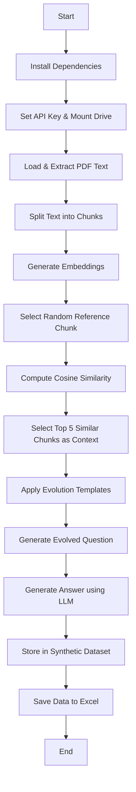

# 🚀 **Synthetic Data Generator for Regulatory Policy Documents**

## ✅ **Colab Notebook**

[🔗 Open in Google Colab](https://colab.research.google.com/drive/1gyh8qXfZnLNVgqUQqOujJBCIxNs7k3vO?usp=sharing)

 

## 📌 Summary

The Synthetic Data Generator is designed to **generate synthetic question-answer datasets** using **regulatory policy PDFs**. It extracts text from PDFs, **embeds the content**, generates **evolved questions** using an LLM (GPT-3.5-turbo), and stores the generated synthetic dataset in an **Excel file**.

 

## 🌊 Flow

🔹 This script **automates** the creation of question-answer datasets for regulatory policy documents.  
🔹 Uses **AI-driven evolution** to make synthetic questions more complex.  
🔹 Stores structured **context-aware Q&A pairs** in an **Excel file for further analysis**.  
🔹 Can be expanded by adding **retrieval optimizations (FAISS)** or **more evolution templates**.

 

## 🛠️ Technology Used

- **📜 PyMuPDF** – Extracts text from PDFs.
- **🧠 OpenAI GPT-3.5-turbo** – Generates questions and answers.
- **📏 LangChain & Sentence Transformers** – Handles embeddings and text processing.
- **📊 Pandas & OpenPyXL** – Stores the dataset in an Excel sheet.

 

## 🏗️ Implementation Steps with Explanation

### 🔹 1. Install Dependencies

The script installs necessary Python libraries using `pip install`.

### 🔹 2. Set Up OpenAI API Key

- The API key is stored in an environment variable to interact with OpenAI models.

### 🔹 3. Mount Google Drive (Colab Only)

- Mounts Google Drive to access policy PDFs stored in a folder.

### 🔹 4. Load PDF Documents & Extract Text

- Uses **PyMuPDFLoader** to read the **policy PDFs**.
- The **TokenTextSplitter** splits the extracted text into **manageable chunks**.

### 🔹 5. Generate Text Embeddings

- Uses **OpenAIEmbeddings** to convert text chunks into **vector representations**.
- These embeddings help in **semantic similarity matching** later.

### 🔹 6. Select Context Using Similarity Search

- A **random chunk** is picked as a reference.
- The script calculates **cosine similarity** between the reference and other embeddings.
- The **top 5 similar chunks** are selected as context.

### 🔹 7. Generate Synthetic Questions via Prompt Engineering

- Uses **three templates** to evolve the question:
  1. **Multi-Context** – Requires multiple context pieces for answering.
  2. **Reasoning-Based** – Demands multi-step logical reasoning.
  3. **Hypothetical Scenario** – Creates a scenario-based question.
- A **random template** is applied **three times** for evolution.
- The final **evolved query** is generated.

### 🔹 8. Generate Expected Answer

- The **LLM (GPT-3.5-turbo)** generates an **expected answer** based on the question and selected context.

### 🔹 9. Store in a Synthetic Dataset Object

- Uses **Pydantic’s `BaseModel`** to structure the dataset (`query`, `expected_output`, and `context`).

### 🔹 10. Save Data to Excel

- Uses **Pandas and OpenPyXL** to save the generated **question-answer pairs** in an **Excel sheet (`test_data.xlsx`)**.
- If the file **does not exist**, it creates a **new Excel file**.
- If the file **already exists**, it **appends the new data** without overwriting old entries.
