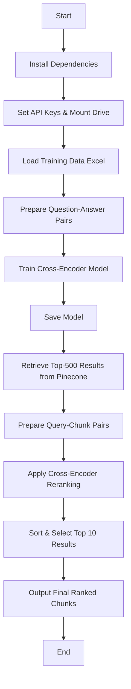

# 🚀 **Cross-Encoder Pipeline for Reranking Regulatory Policy Queries**

## ✅ **Colab Notebook**

[🔗 Open in Google Colab](https://colab.research.google.com/drive/1JY-zbNvT-ovB357F-3aMB07HqHSLrEbe)

<br/>

## 📌 Summary

This **Cross-Encoder Pipeline** is designed to **retrieve and rerank relevant policy text chunks** for a given query. It first retrieves the **top 500 results from Pinecone**, then applies a **Cross-Encoder reranking** to return the most relevant **top 10 results**. The pipeline is useful for **policy compliance checks, legal document analysis, and regulatory retrieval tasks**.

NOTE: The test data generated by `synthetic-data-generation` is used here.

<br/>

## 🌊 Flow

🔹 **Retrieves top-k matches** from Pinecone (vector search).  
🔹 **Uses a Cross-Encoder model** to assign relevance scores to retrieved chunks.  
🔹 **Sorts results by Cross-Encoder scores** and keeps only the most relevant ones.  
🔹 **Trains the Cross-Encoder model** using a **synthetic dataset of question-answer pairs**.  
🔹 Stores the **trained Cross-Encoder model** in Google Drive for future use.



<br/>

## 🛠️ Technology Used

- **🧠 Cross-Encoder (sentence-transformers)** – Reranks document chunks for relevance.
- **📜 Pinecone** – Performs **vector similarity search** on stored regulatory text chunks.
- **🔍 HuggingFaceEmbeddings** – Uses BAAI/bge-base-en-v1.5 to generate vector embeddings for queries.
- **📊 Pandas** – Handles Excel-based training datasets.

<br/>

## 🏗️ Implementation Steps with Explanation

### 🔹 1. Install Dependencies

The script installs required **Python libraries**:

```python
!pip install sentence-transformers langchain_huggingface langchain_pinecone pinecone-client
```

### 🔹 2. Set Up Pinecone & Hugging Face Embeddings

- **Loads Pinecone API Key** and initializes the index.
- Uses **BAAI/bge-base-en-v1.5** from Hugging Face to **generate query embeddings**.

```python
from pinecone import Pinecone
from langchain_huggingface import HuggingFaceEmbeddings

pinecone_api_key = os.getenv("PINECONE_API_KEY")
pc = Pinecone(api_key=pinecone_api_key)
index = pc.Index("profilestore")

embedder = HuggingFaceEmbeddings(model_name='BAAI/bge-base-en-v1.5')
```

### 🔹 3. Load Training Data & Prepare Pairs

- Loads two **Excel files** (`testdata1.xlsx`, `testdata2.xlsx`) and **combines them**.
- **Shuffles** answers to create **negative samples** for training.

```python
df1 = pd.read_excel(folder_path + "testdata1.xlsx")
df2 = pd.read_excel(folder_path + "testdata2.xlsx")

df = pd.concat([df1, df2], ignore_index=True)

shuffled_answers = df["Answer"].sample(frac=1, random_state=42).reset_index(drop=True)

positive_samples = list(zip(df["Question"], df["Answer"], [1.0] * len(df)))
negative_samples = list(zip(df["Question"], shuffled_answers, [0.0] * len(df)))

train_data = positive_samples + negative_samples
random.shuffle(train_data)
```

### 🔹 4. Train the Cross-Encoder Model

- Uses **cross-encoder/ms-marco-MiniLM-L-6-v2** as the base model.
- **Trains** the model using **PyTorch’s DataLoader**.
- **Saves** the trained model in Google Drive.

```python
from sentence_transformers import CrossEncoder, InputExample
from torch.utils.data import DataLoader

train_samples = [InputExample(texts=[str(q), str(a)], label=score) for q, a, score in train_data]
train_dataloader = DataLoader(train_samples, batch_size=8, shuffle=True)

model = CrossEncoder('cross-encoder/ms-marco-MiniLM-L-6-v2')

model.fit(
    train_dataloader=train_dataloader,
    epochs=3,
    warmup_steps=100
)

model.save(folder_path + "CrossEncoderModel")
```

### 🔹 5. Retrieve Top-500 Matches from Pinecone

- **Converts query** into a vector using Hugging Face embeddings.
- **Queries Pinecone** to fetch **top-500** relevant text chunks.

```python
query = "What does 'Schedule A' determine?"
query_vector = embedder.embed_query(query)
pinecone_results = index.query(vector=query_vector, top_k=500, include_metadata=True)
```

### 🔹 6. Apply Cross-Encoder Reranking

- Uses the **trained Cross-Encoder** to rerank **retrieved chunks** based on relevance.
- Constructs **query-chunk pairs** and assigns relevance scores.

```python
query_chunk_pairs = [(query, "".join(doc["metadata"]["text"])) for doc in pinecone_results["matches"]]
cross_encoder_scores = model.predict(query_chunk_pairs)
```

### 🔹 7. Sort & Select Top-10 Relevant Chunks

- Sorts retrieved chunks by **Cross-Encoder scores**.
- Selects **top 10 most relevant** chunks.

```python
reranked_results = sorted(
    zip(pinecone_results["matches"], cross_encoder_scores),
    key=lambda x: x[1], reverse=True
)[:10]
```

### 🔹 8. Output Final Ranked Results

Prints the **top 10 most relevant policy text chunks** based on reranking.

```python
for res, score in reranked_results:
    print(f"Chunk: {res['metadata']['text']}, Score: {score}")
```

<br/>

## 🔥 **Why Use a Cross-Encoder for Reranking?**

✅ **More Accurate**: Instead of relying purely on **vector search**, the **Cross-Encoder** evaluates **both query & document together**.  
✅ **Context-Aware**: Unlike embeddings, which work on **vector distance**, the Cross-Encoder considers **word interactions** between the query and chunk.  
✅ **Optimized Retrieval**: Instead of working on all 500 retrieved chunks, the **top 10 are reranked**, improving **precision**.
