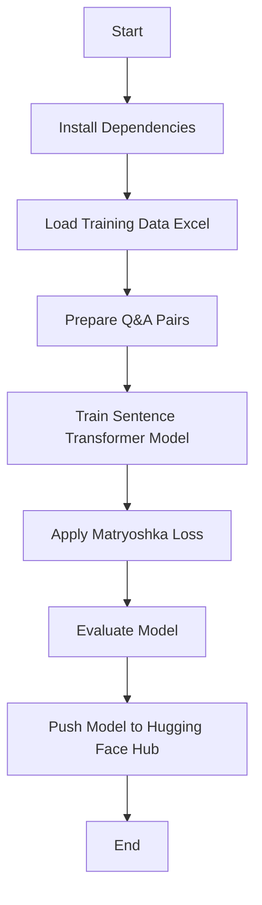

# 🚀 **Fine-Tuning Sentence Transformers for Regulatory Policy Retrieval**

## ✅ **Colab Notebook**

[🔗 Open in Google Colab](https://colab.research.google.com/drive/10ZCRLapSpRI5ZrBfl6vCv58iZfJ03VqP)

## 🎯 **Trained Model on Hugging Face**

[🔗 hshashank06/final-regulatory-policy](https://huggingface.co/hshashank06/final-regulatory-policy)

<br/>

## 📌 **Summary**

This pipeline **fine-tunes a Sentence Transformer model** on regulatory policy data using **Matryoshka Loss** and **Multiple Negatives Ranking Loss**. The fine-tuned model improves **regulatory text retrieval** by optimizing embedding dimensions and ranking quality. The evaluation is performed using **NDCG@10** across different embedding sizes.

<br/>

## 🌊 **Flow**

🔹 **Loads training data (Excel) and prepares datasets** (train/test split).  
🔹 **Fine-tunes a Sentence Transformer model** on policy-related Q&A pairs.  
🔹 **Applies Matryoshka Loss** for multi-scale embedding learning.  
🔹 **Evaluates retrieval performance** using **Information Retrieval Evaluator**.  
🔹 **Pushes the trained model** to Hugging Face Model Hub.



<br/>

## 🛠️ **Technology Used**

- **🧠 Sentence Transformers** – Fine-tunes a transformer model for regulatory text retrieval.
- **📜 Matryoshka Loss** – Trains embeddings at multiple dimensions for scalability.
- **📊 Hugging Face Datasets** – Loads and processes training data.
- **🔍 Cosine Similarity** – Evaluates retrieval performance.
- **💾 Hugging Face Hub** – Stores and shares the fine-tuned model.

<br/>

## 🏗️ **Why Fine-Tuning Helps in Regulatory Policy Retrieval?**

Fine-tuning **adapts the model** to domain-specific regulatory policy language, improving:

✅ **Domain-Specific Understanding** – Pretrained models are trained on general datasets. Fine-tuning helps the model grasp **legal and financial jargon** unique to regulations.

✅ **Better Semantic Retrieval** – In regulatory compliance, **small wording changes** can have **huge legal implications**. Fine-tuning enables the model to rank results more **accurately**.

✅ **Handling Complex Queries** – Regulatory questions often contain **multiple conditions** (e.g., _“What are the capital reserve requirements for insurance companies under Basel III?”_). A fine-tuned model **understands intent better** than a generic model.

✅ **Optimized for Retrieval Performance** – **NDCG@10 scores** across different embedding sizes ensure high-quality ranking, even at **low dimensions**.

✅ **Efficient Storage and Computation** – Using **Matryoshka Loss**, embeddings can be **compressed** without losing much accuracy, making retrieval **faster and cost-effective**.

<br/>

## 🏗️ **Implementation Steps with Explanation**

### 🔹 **1. Install Dependencies**

Install the necessary Python libraries:

```python
!pip install sentence-transformers datasets transformers
```

<br/>

### 🔹 **2. Load and Prepare Training Data**

- Reads regulatory policy **Q&A pairs** from an Excel file (`test_data.xlsx`).
- Splits the dataset into **90% training and 10% testing**.
- Adds unique IDs and **shuffles answers** to create negative samples.

```python
from datasets import load_dataset
import pandas as pd
from sklearn.model_selection import train_test_split

df = pd.read_excel("test_data.xlsx")
df = df.rename(columns={"Question": "anchor", "Answer": "positive"})
df["id"] = range(len(df))

train_df, test_df = train_test_split(df, test_size=0.1, random_state=42)

train_df.to_json("train_dataset.json", orient="records", lines=True)
test_df.to_json("test_dataset.json", orient="records", lines=True)
```

<br/>

### 🔹 **3. Load Model & Prepare Training Data**

- Loads a **pretrained Sentence Transformer model** (`hshashank06/final-regulatory-policy`).
- Uses **Matryoshka dimensions** to train multi-scale embeddings.
- Merges train & test sets to create the **corpus dataset**.

```python
import torch
from sentence_transformers import SentenceTransformer
from datasets import load_dataset, concatenate_datasets

model_id = "hshashank06/final-regulatory-policy"
matryoshka_dimensions = [768, 512, 256, 128, 64]

model = SentenceTransformer(model_id, device="cuda" if torch.cuda.is_available() else "cpu")

test_dataset = load_dataset("json", data_files="test_dataset.json", split="train")
train_dataset = load_dataset("json", data_files="train_dataset.json", split="train")

corpus_dataset = concatenate_datasets([train_dataset, test_dataset])
```

<br/>

### 🔹 **4. Define Information Retrieval Evaluation**

- Uses **cosine similarity** to measure relevance.
- Evaluates retrieval **at different embedding dimensions** (Matryoshka).

```python
from sentence_transformers.evaluation import InformationRetrievalEvaluator, SequentialEvaluator
from sentence_transformers.util import cos_sim

queries = dict(zip(test_dataset["id"], test_dataset["anchor"]))
corpus = dict(zip(corpus_dataset["id"], corpus_dataset["positive"]))

relevant_docs = {q_id: [q_id] for q_id in queries}

matryoshka_evaluators = []
for dim in matryoshka_dimensions:
    ir_evaluator = InformationRetrievalEvaluator(
        queries=queries,
        corpus=corpus,
        relevant_docs=relevant_docs,
        name=f"dim_{dim}",
        truncate_dim=dim,
        score_functions={"cosine": cos_sim},
    )
    matryoshka_evaluators.append(ir_evaluator)

evaluator = SequentialEvaluator(matryoshka_evaluators)
```

<br/>

### 🔹 **5. Fine-Tune the Sentence Transformer Model**

- Uses **Matryoshka Loss** to optimize embeddings at different scales.
- Trains using **Multiple Negatives Ranking Loss** for better retrieval.

```python
from sentence_transformers.losses import MatryoshkaLoss, MultipleNegativesRankingLoss

inner_train_loss = MultipleNegativesRankingLoss(model)
train_loss = MatryoshkaLoss(model, inner_train_loss, matryoshka_dims=matryoshka_dimensions)
```

<br/>

### 🔹 **6. Train and Evaluate the Model**

- Filters out **missing values** in training data.
- Runs the **trainer** for fine-tuning.

```python
train_dataset = train_dataset.filter(lambda x: x["positive"] is not None and x["anchor"] is not None)

from sentence_transformers import SentenceTransformerTrainer

trainer = SentenceTransformerTrainer(
    model=model,
    args=args,
    train_dataset=train_dataset.select_columns(["positive", "anchor"]),
    loss=train_loss,
    evaluator=evaluator,
)

trainer.train()
trainer.save_model()
```

<br/>

### 🔹 **7. Push Model to Hugging Face Hub**

- Saves and uploads the model for public access.

```python
from huggingface_hub import login

token = "YOUR_HUGGINGFACE_TOKEN"
login(token=token, add_to_git_credential=True)

trainer.model.push_to_hub("hshashank06/final-regulatory-policy")
```

<br/>

This **fine-tuned model** is now available on Hugging Face:  
[🔗 hshashank06/final-regulatory-policy](https://huggingface.co/hshashank06/final-regulatory-policy) 🚀

<br/>

## 🔥 **Why Use Matryoshka Loss?**

✅ **Multi-Scale Optimization**: Trains embeddings at different dimensions (768 → 64).  
✅ **Better Efficiency**: Allows use of **smaller embeddings** for faster retrieval.  
✅ **More Accurate Ranking**: Fine-tunes a **Sentence Transformer** with ranking loss.

This pipeline **improves regulatory policy retrieval**, ensuring accurate and efficient document searches. 🚀
