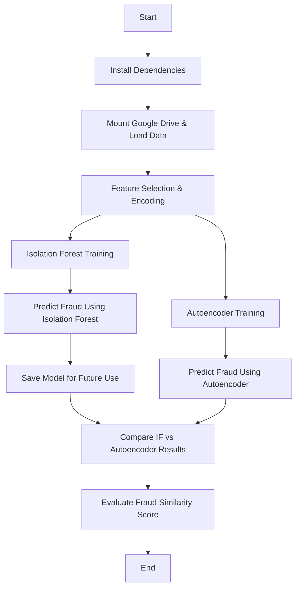

# 🚀 **Fraud Detection using Isolation Forest & Autoencoder**

## ✅ **Colab Notebook**

[🔗 Open in Google Colab](https://colab.research.google.com/drive/1gyh8qXfZnLNVgqUQqOujJBCIxNs7k3vO?usp=sharing)

[🔗 Fraud Detection Dataset](https://huggingface.co/datasets/Nooha/cc_fraud_detection_dataset)

<br/>

## 📌 Summary

This project applies **unsupervised learning** to detect fraudulent transactions using **Isolation Forest** and **Autoencoder** models. The dataset is loaded from a Parquet file, processed, and then used to train both models for anomaly detection. Predictions are saved and analyzed for fraud detection accuracy.

<br/>

> ⚠️ **Due to compute resource limitations, the Autoencoder model could not be fully trained and used in the available environment.**  
> We have attached the code nonetheless. Running it on **Colab Pro** or a **local GPU system** would allow full training. It will be treated as Future Scope.

<br/>

## 🌊 Flow

🔹 The script **preprocesses transaction data** and applies two fraud detection techniques.  
🔹 **Isolation Forest** identifies outliers based on anomaly scores.  
🔹 **Autoencoder** reconstructs transactions and flags high-error samples as anomalies.  
🔹 The results are compared to measure **model similarity**.



<br/>

## 🧠 **Understanding Fraud Detection Techniques**

This project applies **two anomaly detection techniques** to identify fraudulent transactions:

### 🔹 **Isolation Forest (IF)**

**How it works:**

- An **ensemble learning algorithm** based on decision trees.
- Randomly selects features and **splits the dataset** into partitions.
- **Anomalies (fraudulent transactions)** are isolated **faster** in fewer splits, as they behave differently from normal transactions.
- Computes an **anomaly score**, where a lower score indicates a higher likelihood of fraud.

**Why it's effective for fraud detection:**  
✅ **Fast & scalable** – Works well on large datasets.  
✅ **Does not require labeled fraud data** – Works in an **unsupervised** manner.  
✅ **Performs well with high-dimensional data**.

---

### 🔹 **Autoencoder (AE)**

**How it works:**

- A type of **neural network** designed for **unsupervised learning**.
- Learns to **compress (encode)** normal transaction data and **reconstruct (decode)** it.
- Fraudulent transactions **deviate** significantly during reconstruction, leading to **higher reconstruction errors**.
- These **errors** are used to classify fraud.

**Why Autoencoders are useful for fraud detection:**  
✅ **Learns hidden patterns** from normal transactions.  
✅ **Does not require fraud labels** (unsupervised).  
✅ **Flexible for complex fraud patterns**.

<br/>

## 🛠️ Technology Used

- **📦 Pandas & PyArrow** – Handles data loading and preprocessing.
- **🌲 Scikit-Learn (Isolation Forest)** – Detects anomalies using decision trees.
- **🤖 TensorFlow & Keras (Autoencoder)** – Learns transaction patterns for fraud detection.
- **📊 Joblib** – Saves and loads the trained Isolation Forest model.
- **📈 NumPy & Scikit-Learn (Scaling)** – Normalizes data for deep learning models.

<br/>

## 🏗️ Implementation Steps with Explanation & Code

### 🔹 1. Install Dependencies

Install required libraries:

```python
!pip install pandas pyarrow fastparquet scikit-learn tensorflow keras joblib
```

### 🔹 2. Set API Keys & Mount Google Drive

Mount Drive and read the **Parquet file** into a Pandas DataFrame:

```python
from google.colab import drive
import pandas as pd

drive.mount('/content/drive')
df = pd.read_parquet('/content/drive/My Drive/transaction_data.parquet')
df.head()
```

### 🔹 3. Preprocess & Normalize Data

- Selects **key transaction features** (`amt`, `category`, `merchant`, etc.).
- Uses **one-hot encoding** for categorical features and **scales** numeric data.

```python
from sklearn.preprocessing import StandardScaler

df = pd.get_dummies(df, columns=['category', 'merchant'])
scaler = StandardScaler()
df_scaled = scaler.fit_transform(df)
```

### 🔹 4. Train Isolation Forest

- Trains an **Isolation Forest** model with `contamination=0.4`.
- Predicts fraud scores (`-1 = fraud, 1 = normal`).

```python
from sklearn.ensemble import IsolationForest
import joblib

iso_forest = IsolationForest(contamination=0.4, random_state=42)
df['fraud_detected_isoforest'] = iso_forest.fit_predict(df_scaled)

# Save model
joblib.dump(iso_forest, 'isolation_forest_model.pkl')
```

### 🔹 5. Train Autoencoder for Fraud Detection

- **Builds an Autoencoder model** with three encoding and decoding layers.
- **Trains the model** to minimize reconstruction error.

```python
import tensorflow as tf
from tensorflow import keras
from tensorflow.keras.models import Model
from tensorflow.keras.layers import Input, Dense

input_dim = df_scaled.shape[1]
encoding_dim = 16

input_layer = Input(shape=(input_dim,))
encoded = Dense(encoding_dim, activation='relu')(input_layer)
decoded = Dense(input_dim, activation='sigmoid')(encoded)

autoencoder = Model(input_layer, decoded)
autoencoder.compile(optimizer='adam', loss='mse')

autoencoder.fit(df_scaled, df_scaled, epochs=10, batch_size=32, shuffle=True)
```

### 🔹 6. Compute Reconstruction Errors & Predict Fraud

- Computes **Mean Squared Error (MSE)** for each transaction.
- Sets a **threshold (99.6th percentile)** to classify fraud.

```python
import numpy as np

reconstructions = autoencoder.predict(df_scaled)
mse = np.mean(np.abs(reconstructions - df_scaled), axis=1)

threshold = np.percentile(mse, 99.6)
df['fraud_detected_autoencoder'] = mse > threshold
```

### 🔹 7. Compare Isolation Forest & Autoencoder Results

- Measures **similarity** between the two models.
- Prints the percentage of transactions detected as fraudulent by both models.

```python
overlap = (df['fraud_detected_isoforest'] == -1) & (df['fraud_detected_autoencoder'] == True)
print(f"Both models detected fraud in {overlap.sum()} transactions")
```

### 🔹 8. Save Model for Future Use

- Saves the trained **Isolation Forest model** using `joblib`.

```python
joblib.dump(iso_forest, 'isolation_forest_model.pkl')
```
