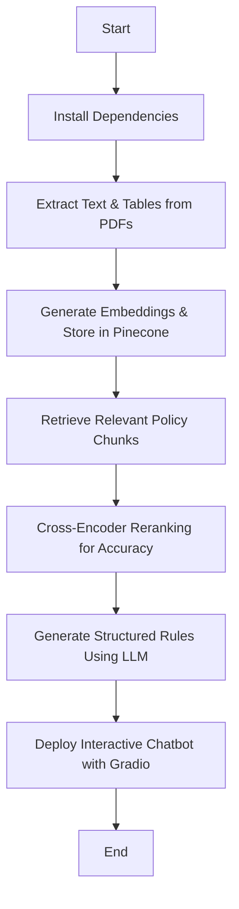

# 🚀 **Automated Rule Generation from Regulatory Policy Documents**

## ✅ **Colab Notebook**

[🔗 Open in Google Colab](https://colab.research.google.com/drive/1mc22UOrOOEf1cysXujzKvB6r9UotCShx)

<br/>

## 📌 **Summary**

This project **automates regulatory rule extraction** from policy documents. It integrates **retrieval-augmented generation (RAG)** with **semantic search, fine-tuned Vector Embeddings, and metadata filtering** to **generate rules dynamically**.

💡 **Core Capabilities:**  
🔹 **Extracts structured rules** from large PDF-based policy documents.  
🔹 **Uses embeddings & cross-encoder reranking** to **retrieve relevant regulatory text**.  
🔹 **Generates clear, actionable regulatory rules** using GPT-based structured content planning.  
🔹 **Deploys a chatbot UI** via **Gradio** to enable **interactive rule exploration**.

<br/>

## 🌊 **Flow**

🔹 **Parses large PDF regulatory documents** and extracts **structured text & tables**.  
🔹 **Stores embeddings** in **Pinecone** for **efficient retrieval**.  
🔹 **Performs RAG-based search** and **Cross-Encoder reranking** to find relevant content.  
🔹 **Generates structured rules** from retrieved chunks using GPT-based planning.  
🔹 **Evaluates risk levels** based on extracted **rules and customer data**.  
🔹 **Provides an interactive chatbot** for policy rule search & risk analysis.



<br/>

## 🛠️ **Technology Used**

| Technology                                | Purpose                                 | Why We Chose It                                      |
| ----------------------------------------- | --------------------------------------- | ---------------------------------------------------- |
| **LangChain & LangGraph**                 | AI workflow management                  | Enables structured RAG execution for rule extraction |
| **Hugging Face Transformers**             | Pretrained embeddings & Embedding fine-tuning | Improves regulatory text understanding               |
| **Ollama & OpenAI API**                   | LLM inference                           | Supports both local & cloud-based rule generation    |
| **Pinecone**                              | Vector search database                  | Enables fast & accurate policy retrieval             |
| **PyMuPDF & pdfplumber**                  | PDF text & table extraction             | Handles regulatory document parsing efficiently      |
| **KeyBERT**                               | Keyword extraction                      | Enhances relevance scoring in search results         |
| **Cross-Encoder (sentence-transformers)** | Query-document reranking                | Improves search accuracy beyond vector similarity    |
| **Metadata Filtering**                    | Context-aware retrieval                 | Ensures users get the most relevant policy rules     |
| **Gradio**                                | Web-based chatbot UI                    | Provides an easy-to-use rule search assistant        |

<br/>

## 🏗️ **Implementation Steps with Explanation**

### 🔹 **1. Install Dependencies**

Install required libraries for **text extraction, embeddings, vector search, and LLM inference**:

```python
!pip install gradio langchain_openai pinecone
!pip install torch transformers sentence-transformers datasets
!pip install keybert pymupdf pinecone-client pdfplumber
!pip install langchain langgraph langchain_community langchain_pinecone langchain_huggingface
```

<br/>

### 🔹 **2. Extract Text & Tables from PDFs**

Regulatory policies are stored as **complex PDFs** with **text and tables**. This step:  
✅ Uses **PyMuPDF & pdfplumber** to extract structured **text & tables**.  
✅ Identifies **headings, subheadings, and sections** dynamically.

```python
from langchain_community.document_loaders import PyMuPDFLoader
from langchain_text_splitters import RecursiveCharacterTextSplitter
import pymupdf

# Function to extract structured text & table rows
def extract_text_by_heading(pdf_path, headings):
    doc = pymupdf.open(pdf_path)
    with pdfplumber.open(pdf_path) as pdf:
        for heading, (start_page, end_page) in headings.items():
            text = ""
            for page_num in range(start_page - 1, end_page if end_page else len(pdf.pages)):
                page = pdf.pages[page_num]
                text += page.extract_text() + "\n"
    return text
```

<br/>

### 🔹 **3. Generate Embeddings & Store in Pinecone**

To enable **fast policy search**, we:  
✔️ Use **Hugging Face embeddings (`hshashank06/final-regulatory-policy`)** for **semantic similarity**.  
✔️ Store vectors in **Pinecone** for **efficient retrieval**.

```python
from pinecone import Pinecone
from langchain_pinecone import PineconeVectorStore
from langchain_huggingface import HuggingFaceEmbeddings

pinecone_api_key = os.getenv("PINECONE_API_KEY")
pc = Pinecone(api_key=pinecone_api_key)
index = pc.Index("profilestore")

embedding_model = HuggingFaceEmbeddings(model_name='hshashank06/final-regulatory-policy')
vector_store = PineconeVectorStore(index=index, embedding=embedding_model)
```

<br/>

### 🔹 **4. Retrieve & Rerank Relevant Policy Chunks**

🔹 **Retrieves the top 400-800 chunks** from Pinecone based on **vector similarity**.  
🔹 **Cross-Encoder reranks** results to improve accuracy.

```python
from sentence_transformers import CrossEncoder

cross_encoder = CrossEncoder('cross-encoder/ms-marco-MiniLM-L-6-v2')
query_chunk_pairs = [(query, doc["metadata"]["text"]) for doc in pinecone_results["matches"]]
cross_encoder_scores = cross_encoder.predict(query_chunk_pairs)

# Merge vector similarity & Cross-Encoder scores
final_scores = [cross * 0.5 + vector * 0.5 for cross, vector in zip(cross_encoder_scores, vector_scores)]
final_results = sorted(zip(pinecone_results["matches"], final_scores), key=lambda x: x[1], reverse=True)[:500]
```

<br/>

### 🔹 **5. Generate Rules Using LLM Planning - AgentWrite ( Plan Agent And Write Agent)**

🔹 Uses **GPT-4** to **structure extracted policy content**.  
🔹 Generates **explicit regulatory rules** from retrieved text.

```python
from langchain_openai import ChatOpenAI

llm2 = ChatOpenAI(model="gpt-4", temperature=0.3)
write_prompt = """
You are an expert in **rule extraction and content structuring**. Your task is to:
1. **Analyze** the structured content plan.
2. **Extract explicit rules and regulations** from the content structure.
3. **Ensure completeness** — all important regulations must be covered.
"""

write_chain = write_prompt | llm2 | StrOutputParser()
final_doc = write_chain.invoke({"plan": plan})
```

<br/>

### 🔹 **6. Deploy Interactive Chatbot Using Gradio**

Provides an **intuitive web-based UI** for **policy rule search**.

```python
import gradio as gr

def chatbot(user_input, chat_history):
    response = final_graph.invoke({"user_input": user_input})
    return chat_history + [(user_input, response["rules_generated"])]

gr.Interface(fn=chatbot, inputs="text", outputs="chatbot").launch()
```

By integrating **AI-powered rule extraction, RAG-based search, and risk scoring**, this project **automates regulatory compliance analysis at scale**. 🚀
