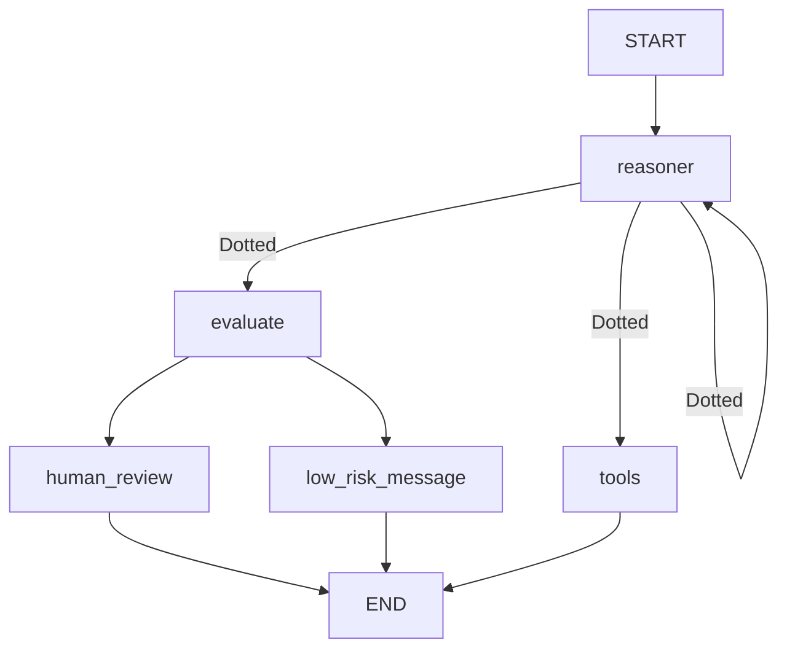

# 🚀 **Risk Analysis & Fraud Detection Using AI**

## ✅ **Colab Notebook**

[🔗 Open in Google Colab](https://colab.research.google.com/drive/1YtXIdUaLORqW6cQMz6ulLa4qcmWmP3qC)

<br/>

## 📌 **Summary**

This project automates **risk analysis and fraud detection** by combining **AI-driven financial risk evaluation** with **unsupervised fraud detection models**. The system:

✅ **Extracts financial transaction data** and evaluates it against **regulatory rules**.  
✅ **Generates a risk score (0-1)** based on **policy guidelines, AI models, and fraud detection techniques**.  
✅ **Uses an Isolation Forest model** to detect **fraudulent transactions**.  
✅ **Employs RAG-based retrieval** for **policy compliance checks**.  
✅ **Deploys an interactive chatbot (Gradio)** to evaluate **customer profiles in real-time**.

<br/>

## 🌊 **Flow**

🔹 **Extracts transaction details & encodes features** for analysis.  
🔹 **Checks regulatory rules** using **retrieved policy documents**.  
🔹 **Runs fraud detection using an Isolation Forest model**.  
🔹 **Assigns a risk score** by combining AI & model predictions.  
🔹 **Triggers manual review** for **high-risk cases** (>0.7).  
🔹 **Deploys a chatbot UI** for real-time transaction analysis.



<br/>

## 🛠️ **Technology Used**

| Technology                                | Purpose                                 | Why We Chose It                                   |
| ----------------------------------------- | --------------------------------------- | ------------------------------------------------- |
| **LangChain & LangGraph**                 | AI workflow & decision automation       | Enables structured execution for risk evaluation  |
| **Hugging Face Transformers**             | Pretrained embeddings & LLM fine-tuning | Enhances retrieval accuracy                       |
| **Ollama & OpenAI API**                   | LLM inference                           | Supports both local & cloud-based fraud detection |
| **Pinecone & FAISS**                      | Vector search database                  | Enables fast retrieval of policy rules            |
| **PyMuPDF & pdfplumber**                  | PDF text extraction                     | Parses regulatory documents efficiently           |
| **Isolation Forest**                      | Fraud detection model                   | Identifies anomalies in financial transactions    |
| **Cross-Encoder (sentence-transformers)** | Query-document reranking                | Improves search accuracy                          |
| **Metadata Filtering**                    | Context-aware retrieval                 | Ensures precise policy rule matching              |
| **Gradio**                                | Web-based chatbot UI                    | Allows interactive transaction risk evaluation    |
| **SerpAPI**                               | Real-time web search                    | Fetches the latest fraud & compliance updates     |

<br/>

## 🏗️ **Implementation Steps with Explanation**

### 🔹 **1. Install Dependencies**

Install all required libraries for **fraud detection, AI-based risk scoring, and vector search**:

```python
!pip install langchain langgraph langchain-huggingface langchain-ollama langchain-openai langchain-community
!pip install pinecone sentence-transformers pymupdf serpapi google-search-results openapi pyarrow fastparquet
!pip install gradio scikit-learn joblib
```

<br/>

### 🔹 **2. Extract Transaction Data**

Transaction details include **amount, merchant, time, and customer demographics**. Data is preprocessed for **feature encoding**:

```python
import pandas as pd
from datetime import datetime

query = {
  "gender": "M",
  "amt": 500,
  "unix_time": "2024-03-23 00:30:00",
  "category": "From Software",
  "merchant": "Amazon",
  "city_pop": 5000000000
}

query["unix_time"] = datetime.strptime(query["unix_time"], "%Y-%m-%d %H:%M:%S").timestamp()
```

<br/>

### 🔹 **3. Retrieve Regulatory Rules from Vector Store**

Policy rules are compared with vectors in vector database using **vector embeddings** for efficient retrieval:

```python
from pinecone import Pinecone
from langchain_huggingface import HuggingFaceEmbeddings

pinecone_api_key = os.getenv("PINECONE_API_KEY")
pc = Pinecone(api_key=pinecone_api_key)
index = pc.Index("profilestore")

embedder = HuggingFaceEmbeddings(model_name='BAAI/bge-base-en-v1.5')
```

<br/>

### 🔹 **4. Run Isolation Forest Fraud Detection**

An **Isolation Forest model** detects **fraudulent transactions** based on **encoded features**:

```python
from sklearn.ensemble import IsolationForest
import joblib

# Load trained Isolation Forest model
model = joblib.load(folder_path + 'unsupervised learning/isolation_forest_model.joblib')

# Encode transaction features
df = pd.read_parquet(folder_path + "unsupervised learning/dataset.parquet")
df_selected = pd.get_dummies(df[["gender", "amt", "unix_time", "category", "merchant", "city_pop"]])

new_transaction = pd.DataFrame([query])
new_transaction_encoded = pd.get_dummies(new_transaction)

# Align columns with training data
missing_cols = set(df_selected.columns) - set(new_transaction_encoded.columns)
new_transaction_encoded = pd.concat([new_transaction_encoded, pd.DataFrame(0, index=new_transaction_encoded.index, columns=missing_cols)], axis=1)

# Predict fraud (-1 = fraud, 1 = normal)
fraud_score = model.predict(new_transaction_encoded)[0]
fraud_detected = 1 if fraud_score == -1 else 0
```

<br/>

### 🔹 **5. Evaluate Risk Score Using AI**

Risk score is **combined from Isolation Forest output & AI policy evaluation**:

```python
def evaluate_risk(state):
    user_query = state.get("query", "")
    risk_score = state.get("risk_score", 0)

    # Compute final risk score
    is_fraud = fraud_detection_check(user_query)
    final_risk_score = is_fraud * 0.5 + risk_score * 0.5

    response = openaillm.invoke(f"""
      The fraud detection model assigned a score of {is_fraud}.
      The final risk score is {final_risk_score}.
    """)

    return {"messages": [response] + state["messages"], "risk_score": final_risk_score}
```

#### Overview of Risk Evaluation

1. **🎯 Extract Risk Score** – Parses risk score (`0-1`) from LLM response using regex.
2. **🔀 Decision Node** – Routes **high-risk cases** (`>0.7`) to **human review**, others to **low-risk message**.
3. **🚨 Human Review Node** – If risk score **≥ 0.7**, triggers a **manual review alert**.
4. **🛡️ Evaluate Risk** – Combines **fraud detection model output** (`0 or 1`) with LLM risk score for final assessment.
5. **📊 Generate Low-Risk Response** – Uses **ChatPromptTemplate** to create a **structured compliance report** with:
   - **📜 Policy Context**
   - **📝 Risk Score Calculation**
   - **✅ Recommendations to reduce risk**
6. **🤖 Final Output** – LLM generates a **compliance report** with **clear, non-sensitive insights**. 🚀

<br/>

### 🔹 **6. Trigger Manual Review for High-Risk Cases**

If **risk score > 0.7**, the system **flags the transaction for human review**:

```python
def decision_node(state):
    return "human_review" if state.get("risk_score", 0) > 0.7 else "low_risk_message"
```

<br/>

### 🔹 **7. Deploy Interactive Chatbot Using Gradio**

A **chatbot UI** allows users to **submit transaction profiles & receive risk evaluations**:

```python
import gradio as gr
import json

def process_input(user_input):
    try:
        parsed_dict = json.loads(user_input)
        return [("User", user_input), ("Bot", f"✅ Processed JSON: {parsed_dict}")], parsed_dict
    except json.JSONDecodeError:
        return [("Bot", "❌ Invalid JSON format. Please enter a valid JSON.")], None

with gr.Blocks() as demo:
    chatbot = gr.Chatbot(label="Chat")
    input1 = gr.Textbox(label="Enter a transaction profile as JSON")
    btn1 = gr.Button("Submit Transaction")
    btn1.click(process_input, inputs=input1, outputs=[chatbot])

demo.launch(debug=True)
```

#### Deployment & UI (Gradio Chatbot)

- Uses **Gradio** for interactive user input.
- Step 1️⃣: Accepts **transaction data (JSON)**.
- Step 2️⃣: Accepts **regulatory policy rules**.
- Step 3️⃣: Runs **risk analysis** and displays results.

<br/>

## **🚀 Conclusion**

This project **combines AI-driven risk scoring, fraud detection, and policy rule validation** to ensure **secure and compliant financial transactions**. With **Gradio-powered interactivity**, users can **analyze transactions in real time**.
